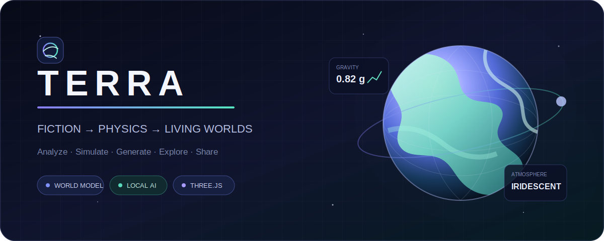
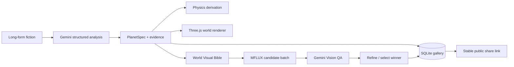

<div align="center">
  

  <br />

  <p><strong>Turn long-form speculative fiction into explorable planetary worlds.</strong></p>
  <p>소설 속 행성의 물리·기후·지형·생명체를 분석하고, 3D 공간과 생성 이미지로 구현합니다.</p>

  <p>
    <a href="https://terra.jiun.dev"><strong>Explore the live demo ↗</strong></a>
    ·
    <a href="#quick-start">Quick start</a>
    ·
    <a href="#architecture">Architecture</a>
  </p>

  <p>
    <a href="https://github.com/jiunbae/terra/actions/workflows/ci.yml"></a>
    <a href="LICENSE"></a>
    
    
    
    
  </p>
</div>

---

## From prose to a living world

Terra reads a long fictional description, separates stated facts from physically plausible inferences, and turns the result into a consistent world model. The same model drives the scientific report, procedural 3D planet, orbital system, surface artwork, and inhabitant portraits.

<table>
  <tr>
    <td width="25%"><strong>01 · Interpret</strong><br /><sub>Structured facts, evidence quotes, confidence, and inferred planetary science.</sub></td>
    <td width="25%"><strong>02 · Simulate</strong><br /><sub>Gravity, density, escape velocity, rotation, atmosphere, climate, and orbital properties.</sub></td>
    <td width="25%"><strong>03 · Materialize</strong><br /><sub>Adaptive Three.js terrain plus locally generated planet, surface, and species artwork.</sub></td>
    <td width="25%"><strong>04 · Share</strong><br /><sub>Persistent public gallery entries with stable links and generated-image metadata.</sub></td>
  </tr>
</table>

## Highlights

- **Evidence-aware world analysis** — Gemini structured output distinguishes explicit statements, physical inference, and speculation while retaining supporting quotes.
- **Scientific derivation** — radius, gravity, and rotation produce mass, density, escape velocity, orbital velocity, synchronous orbit, and centrifugal effects.
- **Adaptive 3D exploration** — procedural terrain, oceans, atmosphere, weather, clouds, rings, moons, city lights, lava, and multi-star illumination.
- **Camera-centered spherical clipmaps** — terrain detail follows the observer so close inspection does not collapse into a smooth low-detail sphere.
- **Distinct visual identities** — continents, archipelagos, craters, canyons, dunes, crystalline fields, volcanic provinces, and engineered terrain use different geometry and material logic.
- **Local generative art** — MFLUX on Apple Silicon creates orbital art, ground-level environments, and full-body inhabitant portraits.
- **Visual continuity** — a locked World Visual Bible keeps palette, atmosphere, terrain, landmarks, and species anatomy consistent across images.
- **Shareable worlds** — SQLite-backed gallery entries preserve the structured spec, derived physics, cover art, quality score, and stable share URL, with local JSON export and capability-authorized deletion.

## Image quality pipeline

| Mode | Candidates | Visual QA | Final pass | Best for |
| --- | ---: | --- | --- | --- |
| **Fast** | 1 | — | Direct output | Iteration and prompt exploration |
| **Balanced** | 2 | Gemini Vision selects the stronger match | Winner retained | Everyday generation |
| **Quality** | 3 previews | Gemini Vision scores fidelity and detail | Full-resolution img2img refinement + recheck | Gallery and hero artwork |

Candidate generation shares one model load, avoiding repeated startup cost. Quality verification scores specification fidelity, distinctive features, environmental fidelity, material detail, and technical quality. If an external upscaler is configured, Terra can run it after the model-native refinement pass.

## Architecture



| Layer | Stack | Responsibility |
| --- | --- | --- |
| Web client | React 19, TypeScript, Vite, Zustand | Analysis workspace, report, gallery, generation UX |
| 3D engine | Three.js, React Three Fiber, GLSL | Adaptive planetary rendering and exploration |
| API | FastAPI, Pydantic, asyncio | Analysis, jobs, rate limits, persistence, static production serving |
| Intelligence | Gemini + Gemini Vision | Structured interpretation and image verification |
| Image generation | MFLUX, Z-Image Turbo | On-device Apple Silicon inference |
| Storage | SQLite + local generated assets | Shareable worlds and image metadata |

## Quick start

### Requirements

- Node.js 22+
- Python 3.12+
- [`uv`](https://docs.astral.sh/uv/)
- A Gemini API key
- Optional: Apple Silicon and MFLUX for local image generation

```bash
git clone https://github.com/jiunbae/terra.git
cd terra

cp .env.example .env
# Add GEMINI_API_KEYS to .env

npm --prefix frontend ci
(cd backend && uv sync --locked)
./start.sh
```

Open `http://127.0.0.1:5173`. The API runs at `http://127.0.0.1:8787`.

For a single production port:

```bash
./start.sh --production
# http://127.0.0.1:8787
```

Production mode builds the frontend into a staging directory before activation, keeps the previous bundle for rollback, binds the origin to loopback, and runs one API worker because image jobs and the MLX model lock are process-local. Use `/api/livez` for process liveness and `/api/readyz` for database, analysis-key, storage, frontend, queue, and optional image-provider diagnostics.

### Local image generation

```bash
make install-images
./start.sh
```

The default profile pins MFLUX 0.18.0 and uses the pre-quantized `filipstrand/Z-Image-Turbo-mflux-4bit` model at its distilled 9-step setting. The first run downloads or loads several gigabytes of weights, so it can take a few minutes. Production can additionally pin a full Hugging Face snapshot commit and local path with `TERRA_IMAGE_MODEL_REVISION`, `TERRA_IMAGE_MODEL_PATH`, and `HF_HUB_OFFLINE=1`.

Useful configuration lives in [`.env.example`](.env.example), including image dimensions, generation timeout, guide strength, request limits, and the optional external upscaler command.

## Development

```bash
make test                    # frontend production build + backend tests
npm --prefix frontend run lint
npm --prefix frontend run test:e2e  # mocked API + real Chromium/WebGL smoke suite
```

The image pipeline is designed so its selection and orchestration behavior can be tested without loading the generative model. Live MFLUX and Gemini calls remain optional integration checks.

## Privacy and deployment notes

- Gallery saves the structured world specification and derived physics, **not the complete source story**; new public saves omit direct evidence quotes while the local report/export remains complete.
- Public worlds can be reported through a bounded moderation intake, and the browser holding the anonymous edit capability can delete its public record.
- `.env`, local databases, generated images, model weights, caches, and editor state are excluded from Git.
- Generated PNGs referenced by saved planets are retained; unreferenced files expire after a configurable TTL and are reclaimed under disk pressure.
- The included rate limits are suitable for a small public demo, not a substitute for account-level quotas and authentication in a large deployment.
- MFLUX is Apple Silicon-specific; the analysis, 3D client, API, and tests can run without it.

For the private-origin macOS LaunchAgent, ingress, authenticated metrics, verified SQLite/image backup, restore drill, log policy, and rollback procedure, see [`deploy/README.md`](deploy/README.md).

## License

Released under the [MIT License](LICENSE).

<div align="center">
  <sub>Built for stories that deserve more than a static illustration.</sub>
</div>
